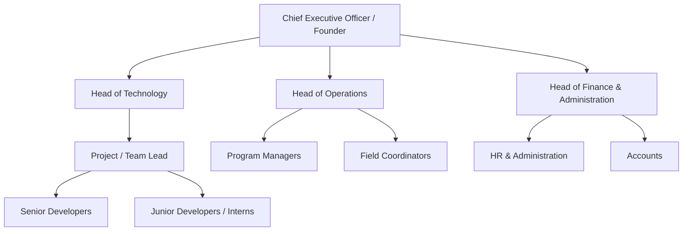
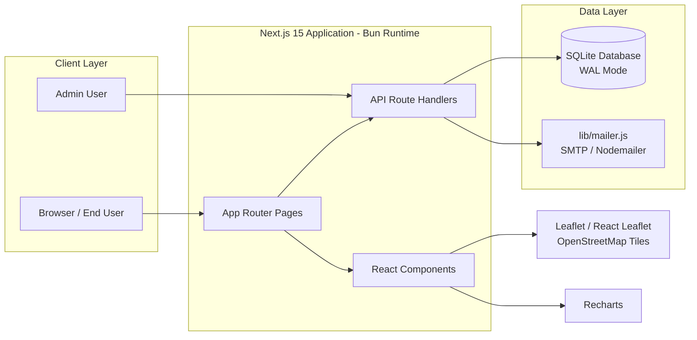
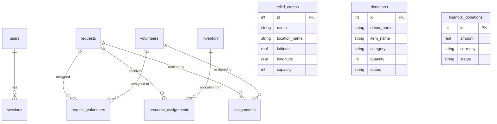

# Supporting Material

This section catalogues all supporting material submitted with the report: the hosting firm and its administrative structure, plans and drawings, technical documents and literature, design and calculation sheets, other relevant material, and the daily project task log.

---

## Appendix A — The Hosting Firm

### A.1 Brief Introduction to IMPACTSTER

> **Placeholder — fill in from the firm's official profile.**
> Suggested points to cover:
> - Name, year of establishment, registered office address
> - Core business / area of specialization (disaster management technology, web platforms)
> - Mission and vision statements
> - Key clients, partnerships, or prior disaster-relief deployments
> - Website and contact details

**IMPACTSTER** hosted the internship during which the **Disaster Relief Coordination Portal** was designed and developed. The portal coordinates flood-relief requests, volunteers, inventory, donations, relief camps, and command-center metrics on a single web platform.

### A.2 Management and Administrative Structure

> **Placeholder — replace names/designations with the actual organization chart of the firm.**

**Intern reporting line:** Intern (Software Development) → Project/Team Lead → Head of Technology.

---

## Appendix B — Sample Plans and Drawings

### B.1 System Architecture Diagram

### B.2 Entity–Relationship Diagram

### B.3 UI Page Flow / Wireframes

| # | Page | Route | Purpose |
|---|---|---|---|
| 1 | Dashboard | `/` | KPIs, charts, recent requests, area impact analysis |
| 2 | Relief Requests | `/requests` | Create, filter, assign volunteers & resources |
| 3 | Volunteers | `/volunteers` | Registration, roster, availability management |
| 4 | Inventory | `/inventory` | Stock tracking, categories, low-stock alerts |
| 5 | Live Map | `/map` | Interactive map: requests, volunteers, resources, camps |
| 6 | Donations | `/donations` | Public donation form and financial donations |
| 7 | Admin Panel | `/admin` | Assignment management and suggestions |
| 8 | Login / Signup | `/login`, `/signup` | Role-based authentication |
| 9 | Settings | `/settings` | Portal configuration (event name, etc.) |

> Attach hand-drawn or Figma wireframes here if available.

---

## Appendix C — Technical Documents and Literature

### C.1 Official Documentation Consulted

| # | Document | Source |
|---|---|---|
| 1 | Next.js Documentation — Getting Started | https://nextjs.org/docs |
| 2 | React — API Reference | https://react.dev/reference/react |
| 3 | Bun — Documentation | https://bun.sh/docs |
| 4 | SQLite — Documentation | https://www.sqlite.org/docs.html |
| 5 | better-sqlite3 — GitHub Repository | https://github.com/WiseLibs/better-sqlite3 |
| 6 | Leaflet — API Reference | https://leafletjs.com |
| 7 | OpenStreetMap — Wiki | https://www.openstreetmap.org |
| 8 | React Leaflet — Documentation | https://react-leaflet.js.org |
| 9 | Leaflet.markercluster — GitHub Repository | https://github.com/Leaflet/Leaflet.markercluster |
| 10 | Recharts — Documentation | https://recharts.org |
| 11 | Tailwind CSS — Documentation | https://tailwindcss.com/docs |
| 12 | Lucide — Icon Toolkit | https://lucide.dev |
| 13 | Framer Motion — Documentation | https://www.framer.com/motion/ |
| 14 | Nodemailer — Documentation | https://nodemailer.com |
| 15 | bcryptjs — GitHub Repository | https://github.com/dcodeIO/bcrypt.js |
| 16 | Inter — Google Fonts | https://fonts.google.com/specimen/Inter |
| 17 | Node.js — Documentation | https://nodejs.org/en/docs |
| 18 | GitHub — Documentation | https://docs.github.com |

Full IEEE-formatted citations appear in `BIBLIOGRAPHY.md`.

### C.2 Domain Literature (Disaster Management)

> **Placeholder — add textbooks/journals consulted, e.g.:**
> - NDMA (National Disaster Management Authority) guidelines on flood preparedness and response
> - FEMA documentation on incident resource management
> - Papers on ICT for disaster response and humanitarian logistics

---

## Appendix D — Design and Calculation Sheets

### D.1 Database Schema (Design Sheet)

| Table | Purpose | Key Columns |
|---|---|---|
| `requests` | Relief requests | location, lat/lng, type (food/water/medicine/shelter), urgency, family_size, status |
| `volunteers` | Volunteer registry | name, phone, email, skills, lat/lng, is_available |
| `inventory` | Relief stock | item_name, category, quantity, unit, lat/lng |
| `request_volunteers` | Volunteer↔Request join | request_id, volunteer_id (UNIQUE pair) |
| `resource_assignments` | Resource↔Request join | request_id, inventory_id, quantity |
| `relief_camps` | Relief camps | name, lat/lng, capacity |
| `donations` | In-kind donations | donor_name, item_name, category, quantity, status |
| `financial_donations` | Monetary donations | donor_name, amount, currency, status |
| `assignments` | Admin task assignments | request_id, volunteer_id, status, priority, due_date |
| `users` | Authentication | email (UNIQUE), password_hash (bcrypt), role |
| `sessions` | Login sessions | user_id, token (UNIQUE), expires_at |

**Integrity constraints applied:** CHECK constraints on enums and positive quantities, FOREIGN KEY with `ON DELETE CASCADE`, UNIQUE constraints on joins, indexes on `status`, `type`, `urgency`, `availability`, `category`, `quantity`, `email`, `role`, and session tokens. SQLite runs in WAL mode with foreign keys enabled.

### D.2 API Endpoint Design Sheet

| Method | Endpoint | Description |
|---|---|---|
| `GET` | `/api/health` | Health check |
| `GET/POST` | `/api/requests` | List / create relief requests |
| `PATCH/DELETE` | `/api/requests/[id]` | Update status / delete request |
| `POST` | `/api/requests/[id]/assign-volunteer` | Assign a volunteer (sends email) |
| `POST` | `/api/requests/[id]/assign-resources` | Allocate inventory resources |
| `GET/POST` | `/api/volunteers` | List / register volunteers |
| `PATCH/DELETE` | `/api/volunteers/[id]` | Update / remove volunteer |
| `POST` | `/api/volunteers/[id]/send-confirmation` | Resend confirmation email |
| `GET` | `/api/volunteers/nearby` | Nearby volunteers by lat/lng/radius |
| `GET/POST` | `/api/inventory` | List / add inventory |
| `PATCH/DELETE` | `/api/inventory/[id]` | Update / remove inventory |
| `GET` | `/api/dashboard` | KPIs, charts, impact analysis |
| `GET/POST` | `/api/dashboard/camps` | List / create relief camps |
| `GET/POST` | `/api/donations`, `/api/donations/[id]` | In-kind donations |
| `GET/POST` | `/api/donations/financial`, `.../[id]` | Financial donations |
| `GET/POST` | `/api/admin/assignments`, `.../[id]` | Admin assignment workflow |
| `POST` | `/api/auth`, `/api/auth/quick-login` | Login / quick login |
| `GET` | `/api/auth/me` | Current session user |

### D.3 Sizing / Calculation Notes

| Item | Value / Formula | Notes |
|---|---|---|
| Seed data | 8 requests · 6 volunteers · 10 inventory items · 2 camps | Auto-seeded on first run |
| Email delivery | SMTP via Nodemailer; Ethereal fallback in dev | Env vars: `SMTP_HOST`, `SMTP_PORT`, `SMTP_USER`, `SMTP_PASS`, `MAIL_FROM` |
| Password hashing | bcrypt (bcryptjs) | Salt rounds per library default |
| Nearby search | Haversine-style filter on stored lat/lng with radius parameter | `GET /api/volunteers/nearby?lat=&lng=&radius=` |

---

## Appendix E — Other Relevant Material

1. **Source code repository** — complete project source at `disaster-relief-portal/` (Next.js app, `lib/` shared DB & mailer, `backend/` Express reference server, `frontend/` Vite reference client).
2. **Application screenshots** — capture one screenshot per page listed in Appendix B.3 and attach.
3. **Sample email templates** — volunteer confirmation and assignment-notification emails sent via Nodemailer (`lib/mailer.js`).
4. **Seed data listing** — the first-run dataset populating the database.
5. **Setup & run guide** — `README.md` and `start.sh` (one-command startup; app on http://localhost:3000).
6. **Performance optimization notes** — Bun runtime, WAL mode, DB indexes, `optimizePackageImports`, client-only map loading, gzip, security headers.

---

## Appendix F — Daily Project Task Log

This section is the daily diary of the work done during the internship. It is written in simple words so it is easy to read and explain.

| Date | Day | Activity / Work Done |
|---|---|---|
| 01 June 2026 | Monday | Met the mentor and learned about the project. The mentor explained what the Disaster Relief Coordination Portal is, the problems it will solve, and the modules that need to be built. |
| 02 June 2026 | Tuesday | Studied the project folders and the technologies used in it. Read the existing pages and API files to understand how the code is organised. Made notes of the main folders and files. |
| 03 June 2026 | Wednesday | **Leave (personal)** |
| 04 June 2026 | Thursday | Set up the development environment on my laptop. Installed Bun and all the project packages, then ran the project. Checked that the app opens properly in the browser. |
| 05 June 2026 | Friday | Learned the basics of Next.js pages and React components. Practised making small components and pages on my own to understand how the frontend is built. |
| 06 June 2026 | Saturday | **Leave (weekend)** |
| 07 June 2026 | Sunday | **Leave (weekend)** |
| 08 June 2026 | Monday | Made the development plan for the project. Divided the whole work into small modules and made a week-wise task list for myself. |
| 09 June 2026 | Tuesday | Designed the database for the project. Planned the tables needed for relief requests, volunteers, inventory, and relief camps. Also decided what information each table should store. |
| 10 June 2026 | Wednesday | **Leave (personal)** |
| 11 June 2026 | Thursday | Created the database tables using SQLite. Added rules (checks) on each field so only valid data can be stored. Linked related tables using foreign keys. |
| 12 June 2026 | Friday | Added indexes on the columns used for searching and filtering so data can be found faster. Checked the table structure and made small improvements. |
| 13 June 2026 | Saturday | **Leave (weekend)** |
| 14 June 2026 | Sunday | **Leave (weekend)** |
| 15 June 2026 | Monday | Added sample data to the database for testing. Inserted example relief requests, volunteers, inventory items, and relief camps so the app has realistic data to work with. |
| 16 June 2026 | Tuesday | Tested the database by performing different operations. Tried inserting, updating, deleting, and filtering records, and checked that everything works correctly. |
| 17 June 2026 | Wednesday | **Leave (personal)** |
| 18 June 2026 | Thursday | Started working on the API routes. Created the list and create APIs for relief requests so that new requests can be added and viewed. |
| 19 June 2026 | Friday | Added the update and delete APIs for relief requests. Also added the status-change feature so a request can move step by step from pending to completed. |
| 20 June 2026 | Saturday | **Leave (weekend)** |
| 21 June 2026 | Sunday | **Leave (weekend)** |
| 22 June 2026 | Monday | Built the volunteer APIs. Added APIs to register a new volunteer, view the volunteer list, update volunteer details, and remove a volunteer. |
| 23 June 2026 | Tuesday | Built the inventory APIs. Added APIs to add new items, view all items, update item details, and remove items from the inventory. |
| 24 June 2026 | Wednesday | **Leave (personal)** |
| 25 June 2026 | Thursday | Built the relief camp APIs to view and add relief camps. Each camp stores its name, location, and capacity. |
| 26 June 2026 | Friday | Connected all the APIs with the database and tested each one. Fixed the validation errors found during testing so that wrong data is not accepted. |
| 27 June 2026 | Saturday | **Leave (weekend)** |
| 28 June 2026 | Sunday | **Leave (weekend)** |
| 29 June 2026 | Monday | Started building the dashboard page. Created the basic layout with a sidebar and a main content area for the dashboard. |
| 30 June 2026 | Tuesday | Added KPI cards on the dashboard. The cards show important numbers like open requests, active volunteers, and total inventory items. |
| 01 July 2026 | Wednesday | **Leave (personal)** |
| 02 July 2026 | Thursday | Added charts to the dashboard using Recharts. Made one chart showing the status of requests and another showing how urgent the requests are. |
| 03 July 2026 | Friday | Showed relief data in lists and tables on the dashboard. This makes it easy for the admin to see the latest information in one place. |
| 04 July 2026 | Saturday | **Leave (weekend)** |
| 05 July 2026 | Sunday | **Leave (weekend)** |
| 06 July 2026 | Monday | Connected the dashboard with the backend APIs. Tested that the numbers and charts update correctly with live data, and fixed the small UI issues found. |
| 07 July 2026 | Tuesday | Started working on volunteer assignment. Added the feature to assign a volunteer to a relief request from the request page. |
| 08 July 2026 | Wednesday | **Leave (personal)** |
| 09 July 2026 | Thursday | Added resource assignment. Inventory items can now be assigned to a relief request along with the quantity needed. |
| 10 July 2026 | Friday | Added request status management. A request can now move from pending to assigned, in progress, and finally completed. |
| 11 July 2026 | Saturday | **Leave (weekend)** |
| 12 July 2026 | Sunday | **Leave (weekend)** |
| 13 July 2026 | Monday | Built the nearby volunteer search feature. Given a location and a distance, the system finds volunteers available in that area. |
| 14 July 2026 | Tuesday | Started adding the interactive map using Leaflet. Added the base map to the map page of the app. |
| 15 July 2026 | Wednesday | **Leave (personal)** |
| 16 July 2026 | Thursday | Added markers on the map for relief requests, volunteers, and relief camps. Each marker shows basic details when clicked. |
| 17 July 2026 | Friday | Added email sending to the project using Nodemailer. A confirmation email is now sent when a new volunteer registers. |
| 18 July 2026 | Saturday | **Leave (weekend)** |
| 19 July 2026 | Sunday | **Leave (weekend)** |
| 20 July 2026 | Monday | Added admin login to the project. Passwords are stored securely using hashing, and a login session is created for the admin user. |
| 21 July 2026 | Tuesday | Built the admin panel for managing assignments. Also added donation tracking so that both goods and money donations can be recorded. |
| 22 July 2026 | Wednesday | **Leave (personal)** |
| 23 July 2026 | Thursday | Tested the complete application end to end and fixed the bugs found in the different modules. |
| 24 July 2026 | Friday | Made the app faster with database improvements. Updated the project documentation and gave the final project demonstration to the mentor. |
| 25 July 2026 | Saturday | **Leave (weekend)** |
| 26 July 2026 | Sunday | **Leave (weekend)** |

---

*This document is part of the internship report; fill placeholders marked in blockquotes with official firm details, and renumber appendices if additional material is added.*
